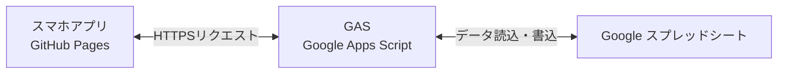

# note有料記事原稿：【コピペで即稼働】初期費用0円でスマホが「棚卸しスキャナー」に！Googleスプレッドシート連携・QRコード単品在庫管理システム開発ガイド（ソースコード完全公開）

---

## 【無料公開エリア】ここから導入

こんにちは！個人商店や中小規模の小売店、アパレルショップ、そして「着物専門店」の皆さま、日々の「在庫管理」や「棚卸し」に頭を悩ませていませんか？

「1点もの（単品）が多くて、どれが売れてどれが残っているのか把握しきれない…」
「棚卸しの日は、紙のリストを持って棚を回り、後からPCでスプレッドシートに入力し直す二度手間をしている…」
「専用の在庫管理システムを導入したいけれど、初期費用が数十万円、月額も数万円かかるのは厳しすぎる…」

そんな悩みを、**「完全に無料のGoogleツール」と「スマホ1台」だけで、今日から解消できる方法**があります。

今回ご紹介するのは、**スマートフォンをそのまま「QRコードスキャナー」に変身させ、値札のQRコードを「ピピッ」とスキャンするだけで、Googleスプレッドシートの在庫データがリアルタイムに「棚卸し完了」へと自動更新されるシステム**です。

特別な機器の購入は一切不要。データベースの難しい設定もありません。
本記事では、このシステムの**すべてのソースコードを省略なしで公開**し、ノンプログラマーの方でもコピペするだけでそのまま動作させられる手順を徹底解説します。

---

### この記事で作る「QRコード棚卸システム」の5つの魅力

#### 1. 完全無料で運用できる
使うのは、Googleアカウント（スプレッドシート、Google Apps Script）とGitHub（無料のWeb公開機能）だけ。システム維持費などのランニングコストは**「永久に0円」**です。

#### 2. スマホのカメラがそのままスキャナーになる
オープンソースの高性能カメラライブラリを使用し、スマートフォンの背面カメラで値札のQRコードを高速デコードします。
さらに、読み取り成功時には**「ピピピッ」という電子音（ビープ音）が鳴り、画面が緑色にフラッシュする視覚的フィードバック**も実装。まるで専用の業務用端末を使っているかのような快適な作業感を実現しています。

#### 3. 新規登録と同時に「管理用QRタグ」をその場で生成・印刷
アプリ上の登録フォームから新しい商品を入力するだけで、その場でQRコード付きの「商品管理タグ（値札用）」が自動生成されます。
印刷ボタンをワンタップするだけで、余計なヘッダーなどを隠し、タグ単体（60mm × 90mmサイズ）をきれいに紙やラベルへ印刷できる専用のレイアウト設定を組み込んでいます。

#### 4. 在庫のリアルタイム検索と色分け
登録した商品は一覧画面でいつでも確認でき、キーワード、商品カテゴリ、在庫ステータス（保管中・レンタル中など）で瞬時に絞り込めます。
棚卸しが「完了した商品（緑色）」と「未完了の商品（赤色）」が一目でわかるため、数千件の在庫があっても棚卸しの漏れを瞬時に見つけられます。

#### 5. Googleスプレッドシートと双方向でリアルタイム同期
データはすべて、あなたがいつも使っているGoogleスプレッドシートに保存されます。
アプリから登録すればシートに1秒で行が追加され、スマホでスキャンすればシートの「最終棚卸日」が自動更新されます。もちろん、PCのスプレッドシート側から手動でデータを書き換えても、スマホアプリの一覧に即座に反映されます。

---

### システムの全体像（アーキテクチャ）

難しいサーバーの知識は不要です。以下の3つのパーツを連携させるだけで動きます。



- **フロント（スマホ画面）**: HTML / CSS / JavaScript で構築。GitHub Pages（無料）に配置することで、スマホやPCのブラウザからアクセス可能になります。
- **バックエンド（API）**: Google Apps Script (GAS) を使用。アプリから届く「スキャンしたよ」「新しい商品を登録したよ」というデータをスプレッドシートに中継します。
- **データベース**: 使い慣れた「Googleスプレッドシート」そのものです。

---

### 本記事（有料エリア）で手に入るもの

この記事をご購入いただくと、以下のリソースと情報をすべて手に入れることができます。

1. **コピペでそのまま動く完全ソースコード一式**
   - フロント画面 (`index.html`)
   - 和モダンデザイン＆印刷スタイル (`style.css`)
   - セキュリティ対策済データ通信モジュール (`api.js`)
   - スキャナー＆UI制御プログラム (`app.js`)
   - スプレッドシート連携用スクリプト (`コード.gs`)
   - 開発・デプロイ設定用ファイル (`package.json`, `vite.config.js`)
2. **スキャン動作テスト用の「QRコードシート」**
   - 印刷したり画面に表示するだけで、すぐにスキャン動作をシミュレーションできるテスト用HTMLファイルも同梱しています。
3. **つまずきやすい「セキュリティ制限（CORS・マルチログイン）」の完全解決マニュアル**
   - 個人開発で必ずと言っていいほど直面する「ブラウザの通信ブロック（CORSエラー）」や、Googleアカウント複数ログイン時の「ファイルが存在しませんエラー」の具体的な回避ハックをすべて記載しています。

自分で高額なシステムを開発・外注すれば数十万円かかる仕組みを、コピペと簡単なクリック操作だけで、最短30分で稼働させることができます。日々の面倒な棚卸し業務を、スマートで快適なものにアップデートしましょう！

---

## 【有料公開エリア】ここから有料枠（購入者のみ閲覧可能）

ご購入ありがとうございます！
それではさっそく、システムの構築を始めましょう。まずは、コピペするだけのソースコードをすべて公開します。

---

## 1. コピペ用ソースコード一式

プロジェクトのフォルダを作成し、以下のファイル名でそれぞれ保存してください。

### ① `index.html`（アプリの骨組み）
```html
<!DOCTYPE html>
<html lang="ja">
<head>
  <meta charset="UTF-8">
  <meta name="viewport" content="width=device-width, initial-scale=1.0, maximum-scale=1.0, user-scalable=no">
  <title>着物在庫管理 & QR棚卸システム</title>
  
  <!-- Tailwind CSS CDN -->
  <script src="https://cdn.tailwindcss.com"></script>
  <script>
    tailwind.config = {
      theme: {
        extend: {
          colors: {
            kimono: {
              charcoal: '#1E1E24', // 漆黒 (しっこく) - 主要背景やテキスト
              red: '#8A1C14',      // 深緋 (こきあけ) - アクセント・未棚卸
              gold: '#C5A059',     // 金茶 (きんちゃ) - ボーダー・セカンダリ
              cream: '#FAF6F0',    // 生成り (きなり) - アプリ背景
              card: '#FFFFFF',     // カード背景
              green: '#2D6A4F',    // 若竹色 (わかたけいろ) - 完了ステータス
              muted: '#7F7F7F',    // 薄墨色 (うすずみいろ) - 補助テキスト
            }
          },
          fontFamily: {
            serif: ['"Noto Serif JP"', 'serif'],
            sans: ['"Outfit"', '"Helvetica Neue"', 'Arial', 'sans-serif'],
          }
        }
      }
    }
  </script>

  <!-- Google Fonts (Noto Serif JP & Outfit) -->
  <link rel="preconnect" href="https://fonts.googleapis.com">
  <link rel="preconnect" href="https://fonts.gstatic.com" crossorigin>
  <link href="https://fonts.googleapis.com/css2?family=Noto+Serif+JP:wght@400;600;700&family=Outfit:wght@300;400;500;600;700&display=swap" rel="stylesheet">

  <!-- Lucide Icons CDN -->
  <script src="https://unpkg.com/lucide@latest"></script>

  <!-- html5-qrcode (QRコード読み取り用ライブラリ) -->
  <script src="https://unpkg.com/html5-qrcode" type="text/javascript"></script>

  <!-- qrcodejs (QRコード生成用ライブラリ) -->
  <script src="https://cdnjs.cloudflare.com/ajax/libs/qrcodejs/1.0.0/qrcode.min.js" type="text/javascript"></script>

  <!-- カスタムスタイルシート -->
  <link rel="stylesheet" href="style.css">
</head>
<body class="bg-kimono-cream text-kimono-charcoal font-sans min-h-screen flex flex-col pb-20 select-none">

  <!-- スキャン時の画面フラッシュ用オーバーレイ -->
  <div id="scan-flash" class="fixed inset-0 bg-green-500 opacity-0 pointer-events-none z-50 transition-opacity duration-150"></div>

  <!-- ヘッダー -->
  <header class="bg-kimono-charcoal text-white py-4 px-4 sticky top-0 z-30 shadow-md border-b border-kimono-gold">
    <div class="max-w-md mx-auto flex items-center justify-between">
      <div class="flex items-center gap-2">
        <span class="w-2 h-6 bg-kimono-red inline-block"></span>
        <h1 class="font-serif font-semibold text-lg tracking-wider">きもの在庫・棚卸</h1>
      </div>
      <span class="text-xs border border-kimono-gold/50 px-2 py-0.5 rounded text-kimono-gold">単品管理</span>
    </div>
  </header>

  <!-- メインコンテンツ (SPAの各画面) -->
  <main class="flex-1 max-w-md w-full mx-auto p-4">

    <!-- ① 棚卸しスキャン画面 -->
    <section id="view-scan" class="space-y-4">
      <div class="bg-white rounded-2xl p-4 shadow-sm border border-kimono-gold/10">
        <h2 class="font-serif text-lg font-bold border-b border-kimono-gold/20 pb-2 mb-4 flex items-center gap-2">
          <i data-lucide="qr-code" class="text-kimono-red"></i>
          QRコード棚卸しスキャン
        </h2>

        <!-- カメラ切り替え・制御 -->
        <div class="flex justify-between items-center mb-3">
          <span class="text-xs text-kimono-muted">値札のQRコードをカメラにかざしてください</span>
          <button id="btn-toggle-camera-facing" class="text-xs flex items-center gap-1 bg-kimono-cream px-2 py-1 rounded border border-kimono-gold/30 text-kimono-charcoal hover:bg-kimono-gold/10 transition-colors">
            <i data-lucide="refresh-cw" class="w-3.5 h-3.5"></i>カメラ切替
          </button>
        </div>

        <!-- スキャンエリア -->
        <div class="relative overflow-hidden rounded-xl bg-black border-2 border-kimono-gold/30 aspect-square flex flex-col justify-center items-center">
          <div id="reader" class="w-full h-full"></div>
          
          <!-- カメラ未起動時のプレースホルダー -->
          <div id="scanner-placeholder" class="absolute inset-0 flex flex-col items-center justify-center bg-zinc-900 text-zinc-400 p-6 text-center space-y-4">
            <div class="w-16 h-16 rounded-full bg-zinc-800 flex items-center justify-center border border-zinc-700 animate-pulse">
              <i data-lucide="camera" class="w-8 h-8 text-kimono-gold"></i>
            </div>
            <div>
              <p class="font-medium text-sm text-zinc-200">カメラが停止しています</p>
              <p class="text-xs text-zinc-500 mt-1">下のボタンを押してカメラを起動してください</p>
            </div>
          </div>

          <!-- 和風のスキャンガイド枠 -->
          <div id="scan-target-box" class="absolute w-64 h-64 border-2 border-dashed border-kimono-gold pointer-events-none rounded-lg flex items-center justify-center hidden">
            <div class="absolute w-8 h-8 border-t-4 border-l-4 border-kimono-red top-0 left-0"></div>
            <div class="absolute w-8 h-8 border-t-4 border-r-4 border-kimono-red top-0 right-0"></div>
            <div class="absolute w-8 h-8 border-b-4 border-l-4 border-kimono-red bottom-0 left-0"></div>
            <div class="absolute w-8 h-8 border-b-4 border-r-4 border-kimono-red bottom-0 right-0"></div>
            <div class="w-full h-0.5 bg-kimono-red/50 absolute animate-scan-line"></div>
          </div>
        </div>

        <!-- カメラ起動・停止ボタン -->
        <div class="mt-4">
          <button id="btn-camera-control" class="w-full py-3.5 bg-kimono-red hover:bg-red-800 text-white rounded-xl font-medium shadow-md shadow-kimono-red/20 transition-all flex items-center justify-center gap-2">
            <i data-lucide="play" class="w-5 h-5"></i>
            <span>カメラを起動する</span>
          </button>
        </div>
      </div>

      <!-- スキャン履歴（本日の読み取り結果） -->
      <div class="bg-white rounded-2xl p-4 shadow-sm border border-kimono-gold/10">
        <div class="flex justify-between items-center border-b border-kimono-gold/20 pb-2 mb-3">
          <h3 class="font-serif text-sm font-bold flex items-center gap-1.5">
            <i data-lucide="history" class="w-4 h-4 text-kimono-muted"></i>
            本日のスキャン履歴
          </h3>
          <span id="scan-count-badge" class="bg-kimono-cream text-kimono-red border border-kimono-red/20 px-2 py-0.5 rounded-full text-xs font-semibold">0件</span>
        </div>
        <div id="scan-history-list" class="space-y-2 max-h-48 overflow-y-auto divide-y divide-zinc-100">
          <p class="text-xs text-center text-kimono-muted py-4">スキャンした履歴がここに表示されます</p>
        </div>
      </div>
    </section>

    <!-- ② 在庫一覧・検索画面 -->
    <section id="view-list" class="space-y-4 hidden">
      <!-- 簡易ステータスサマリー -->
      <div class="grid grid-cols-3 gap-2">
        <div class="bg-white rounded-xl p-3 shadow-xs border border-kimono-gold/10 text-center">
          <p class="text-[10px] text-kimono-muted uppercase tracking-wider">総在庫数</p>
          <p id="summary-total" class="text-xl font-bold mt-0.5 text-kimono-charcoal">0</p>
        </div>
        <div class="bg-emerald-50 rounded-xl p-3 shadow-xs border border-emerald-100 text-center">
          <p class="text-[10px] text-emerald-800 uppercase tracking-wider">棚卸完了</p>
          <p id="summary-completed" class="text-xl font-bold mt-0.5 text-kimono-green">0</p>
        </div>
        <div class="bg-red-50 rounded-xl p-3 shadow-xs border border-red-100 text-center">
          <p class="text-[10px] text-red-800 uppercase tracking-wider">未棚卸</p>
          <p id="summary-pending" class="text-xl font-bold mt-0.5 text-kimono-red">0</p>
        </div>
      </div>

      <!-- 検索・フィルターエリア -->
      <div class="bg-white rounded-2xl p-4 shadow-sm border border-kimono-gold/10 space-y-3">
        <!-- 検索キーワード -->
        <div class="relative">
          <input type="text" id="filter-search" placeholder="商品番号、商品名を入力..." class="w-full bg-kimono-cream pl-9 pr-4 py-2 text-sm rounded-xl border border-kimono-gold/30 focus:outline-none focus:ring-1 focus:ring-kimono-gold placeholder-kimono-muted/70">
          <i data-lucide="search" class="w-4 h-4 text-kimono-muted absolute left-3 top-3"></i>
        </div>

        <div class="grid grid-cols-2 gap-2">
          <!-- 種類フィルター -->
          <div>
            <label class="text-[10px] text-kimono-muted font-bold block mb-1">種類</label>
            <select id="filter-type" class="w-full bg-kimono-cream text-xs rounded-lg p-2 border border-kimono-gold/20 focus:outline-none focus:ring-1 focus:ring-kimono-gold">
              <option value="">すべて</option>
              <option value="振袖">振袖</option>
              <option value="訪問着">訪問着</option>
              <option value="反物">反物</option>
              <option value="帯">帯</option>
              <option value="小物">小物</option>
              <option value="その他">その他</option>
            </select>
          </div>

          <!-- ステータスフィルター -->
          <div>
            <label class="text-[10px] text-kimono-muted font-bold block mb-1">在庫ステータス</label>
            <select id="filter-status" class="w-full bg-kimono-cream text-xs rounded-lg p-2 border border-kimono-gold/20 focus:outline-none focus:ring-1 focus:ring-kimono-gold">
              <option value="">すべて</option>
              <option value="保管中">保管中</option>
              <option value="レンタル中">レンタル中</option>
              <option value="クリーニング中">クリーニング中</option>
              <option value="売上済">売上済</option>
            </select>
          </div>
        </div>

        <!-- 棚卸し状況フィルター -->
        <div class="flex gap-2 pt-1">
          <button id="btn-filter-audit-all" class="flex-1 py-1.5 rounded-lg text-xs font-medium border border-kimono-gold text-white bg-kimono-charcoal">すべて</button>
          <button id="btn-filter-audit-pending" class="flex-1 py-1.5 rounded-lg text-xs font-medium border border-kimono-gold/20 text-kimono-red bg-kimono-cream hover:bg-kimono-gold/10">未完了のみ</button>
          <button id="btn-filter-audit-completed" class="flex-1 py-1.5 rounded-lg text-xs font-medium border border-kimono-gold/20 text-kimono-green bg-kimono-cream hover:bg-kimono-gold/10">完了済のみ</button>
        </div>
      </div>

      <!-- 在庫リスト -->
      <div id="inventory-list" class="space-y-3">
        <!-- JSで動的に追加されます -->
      </div>
    </section>

    <!-- ③ 新規商品登録画面 -->
    <section id="view-register" class="space-y-4 hidden">
      <div class="bg-white rounded-2xl p-4 shadow-sm border border-kimono-gold/10">
        <h2 class="font-serif text-lg font-bold border-b border-kimono-gold/20 pb-2 mb-4 flex items-center gap-2">
          <i data-lucide="plus-circle" class="text-kimono-red"></i>
          新規着物の登録
        </h2>

        <form id="form-register-item" class="space-y-3">
          <!-- 商品番号 -->
          <div>
            <label class="block text-xs font-bold text-kimono-charcoal mb-1">商品番号 <span class="text-kimono-red">*</span></label>
            <div class="flex gap-2">
              <input type="text" id="reg-code" placeholder="例: KM-2026-001" required class="flex-1 bg-kimono-cream px-3 py-2 text-sm rounded-lg border border-kimono-gold/30 focus:outline-none focus:ring-1 focus:ring-kimono-gold">
              <button type="button" id="btn-gen-code" class="bg-kimono-charcoal text-white hover:bg-zinc-800 text-xs px-3 rounded-lg border border-kimono-gold/50 flex items-center gap-1 transition-colors">
                <i data-lucide="sparkles" class="w-3.5 h-3.5 text-kimono-gold"></i>自動生成
              </button>
            </div>
          </div>

          <!-- 商品名 -->
          <div>
            <label class="block text-xs font-bold text-kimono-charcoal mb-1">商品名 <span class="text-kimono-red">*</span></label>
            <input type="text" id="reg-name" placeholder="例: 辻が花 絞り振袖" required class="w-full bg-kimono-cream px-3 py-2 text-sm rounded-lg border border-kimono-gold/30 focus:outline-none focus:ring-1 focus:ring-kimono-gold">
          </div>

          <!-- 種類 & 仕立て -->
          <div class="grid grid-cols-2 gap-2">
            <div>
              <label class="block text-xs font-bold text-kimono-charcoal mb-1">種類</label>
              <select id="reg-type" class="w-full bg-kimono-cream text-sm rounded-lg p-2 border border-kimono-gold/30 focus:outline-none focus:ring-1 focus:ring-kimono-gold">
                <option value="振袖">振袖</option>
                <option value="訪問着">訪問着</option>
                <option value="反物">反物</option>
                <option value="帯">帯</option>
                <option value="小物">小物</option>
                <option value="その他">その他</option>
              </select>
            </div>
            <div>
              <label class="block text-xs font-bold text-kimono-charcoal mb-1">仕立て状態</label>
              <select id="reg-tailor" class="w-full bg-kimono-cream text-sm rounded-lg p-2 border border-kimono-gold/30 focus:outline-none focus:ring-1 focus:ring-kimono-gold">
                <option value="仕立て上がり">仕立て上がり</option>
                <option value="反物">反物</option>
                <option value="レンタル用">レンタル用</option>
              </select>
            </div>
          </div>

          <!-- 価格設定 -->
          <div class="grid grid-cols-2 gap-2">
            <div>
              <label class="block text-xs font-bold text-kimono-charcoal mb-1">販売価格 (税込)</label>
              <input type="number" id="reg-price-sale" placeholder="¥" class="w-full bg-kimono-cream px-3 py-2 text-sm rounded-lg border border-kimono-gold/30 focus:outline-none focus:ring-1 focus:ring-kimono-gold">
            </div>
            <div>
              <label class="block text-xs font-bold text-kimono-charcoal mb-1">レンタル価格 (税込)</label>
              <input type="number" id="reg-price-rent" placeholder="¥" class="w-full bg-kimono-cream px-3 py-2 text-sm rounded-lg border border-kimono-gold/30 focus:outline-none focus:ring-1 focus:ring-kimono-gold">
            </div>
          </div>

          <!-- サイズ設定 -->
          <div class="grid grid-cols-2 gap-2">
            <div>
              <label class="block text-xs font-bold text-kimono-charcoal mb-1">身丈 (cm)</label>
              <input type="number" step="0.1" id="reg-size-mitake" placeholder="例: 165" class="w-full bg-kimono-cream px-3 py-2 text-sm rounded-lg border border-kimono-gold/30 focus:outline-none focus:ring-1 focus:ring-kimono-gold">
            </div>
            <div>
              <label class="block text-xs font-bold text-kimono-charcoal mb-1">裄丈 (cm)</label>
              <input type="number" step="0.1" id="reg-size-yuki" placeholder="例: 68" class="w-full bg-kimono-cream px-3 py-2 text-sm rounded-lg border border-kimono-gold/30 focus:outline-none focus:ring-1 focus:ring-kimono-gold">
            </div>
          </div>

          <!-- 初期ステータス -->
          <div>
            <label class="block text-xs font-bold text-kimono-charcoal mb-1">初期ステータス</label>
            <select id="reg-status" class="w-full bg-kimono-cream text-sm rounded-lg p-2 border border-kimono-gold/30 focus:outline-none focus:ring-1 focus:ring-kimono-gold">
              <option value="保管中">保管中</option>
              <option value="レンタル中">レンタル中</option>
              <option value="クリーニング中">クリーニング中</option>
              <option value="売上済">売上済</option>
            </select>
          </div>

          <!-- 登録ボタン -->
          <div class="pt-2">
            <button type="submit" class="w-full py-3 bg-kimono-charcoal hover:bg-zinc-800 text-white border border-kimono-gold rounded-xl font-medium shadow-md transition-all flex items-center justify-center gap-2">
              <i data-lucide="save" class="w-4 h-4 text-kimono-gold"></i>
              登録してQRコードを作成
            </button>
          </div>
        </form>
      </div>

      <!-- 登録完了後のQRコード表示 & 印刷エリア -->
      <div id="qr-result-area" class="bg-white rounded-2xl p-4 shadow-sm border border-kimono-gold/10 text-center space-y-4 hidden scroll-mt-20">
        <div class="border-b border-kimono-gold/20 pb-2 flex justify-between items-center">
          <h3 class="font-serif text-sm font-bold text-kimono-green flex items-center gap-1">
            <i data-lucide="check-circle-2" class="w-4 h-4"></i>
            商品登録が完了しました
          </h3>
          <button id="btn-close-qr-result" class="text-kimono-muted hover:text-kimono-charcoal">
            <i data-lucide="x" class="w-4 h-4"></i>
          </button>
        </div>

        <!-- 印刷用タグカード -->
        <div class="bg-white p-6 border-2 border-kimono-gold/30 rounded-xl max-w-[280px] mx-auto flex flex-col items-center justify-center space-y-3" id="print-tag-card">
          <p class="font-serif text-sm font-bold tracking-wider border-b border-kimono-gold pb-1 w-full text-center">着物単品管理タグ</p>
          <div id="qrcode-container" class="p-2 bg-white inline-block"></div>
          <p id="qr-code-text" class="font-mono text-sm font-semibold tracking-widest text-zinc-800"></p>
          <div class="text-left w-full space-y-1 text-xs border-t border-dotted border-zinc-200 pt-2 text-zinc-600">
            <p class="truncate"><span class="font-medium text-zinc-800">品名:</span> <span id="qr-name-text"></span></p>
            <div class="flex justify-between">
              <p><span class="font-medium text-zinc-800">種類:</span> <span id="qr-type-text"></span></p>
              <p><span class="font-medium text-zinc-800">仕立:</span> <span id="qr-tailor-text"></span></p>
            </div>
            <p id="qr-size-text" class="hidden"></p>
          </div>
        </div>

        <!-- 印刷ボタン -->
        <button id="btn-print-tag" class="w-full py-2 bg-kimono-cream hover:bg-kimono-gold/10 text-kimono-charcoal border border-kimono-gold rounded-lg text-xs font-semibold flex items-center justify-center gap-1.5 transition-colors">
          <i data-lucide="printer" class="w-4 h-4 text-kimono-gold"></i>
          この商品タグを印刷する
        </button>
      </div>
    </section>

  </main>

  <!-- ボトムナビゲーションバー -->
  <nav class="fixed bottom-0 left-0 right-0 bg-kimono-charcoal text-white border-t border-kimono-gold z-40 shadow-lg">
    <div class="max-w-md mx-auto flex justify-around items-center h-16">
      
      <!-- スキャンタブ -->
      <button id="nav-scan" class="flex flex-col items-center justify-center w-full h-full text-kimono-gold transition-colors duration-150">
        <i data-lucide="qr-code" class="w-5 h-5 mb-1"></i>
        <span class="text-[10px] font-medium tracking-wide">棚卸スキャン</span>
      </button>

      <!-- 一覧タブ -->
      <button id="nav-list" class="flex flex-col items-center justify-center w-full h-full text-zinc-400 hover:text-white transition-colors duration-150">
        <i data-lucide="database" class="w-5 h-5 mb-1"></i>
        <span class="text-[10px] font-medium tracking-wide">在庫一覧</span>
      </button>

      <!-- 新規登録タブ -->
      <button id="nav-register" class="flex flex-col items-center justify-center w-full h-full text-zinc-400 hover:text-white transition-colors duration-150">
        <i data-lucide="plus-circle" class="w-5 h-5 mb-1"></i>
        <span class="text-[10px] font-medium tracking-wide">新規登録</span>
      </button>

    </div>
  </nav>

  <!-- スキャン結果・詳細確認ポップアップモーダル -->
  <div id="modal-scan-result" class="fixed inset-0 bg-black/60 z-50 flex items-center justify-center p-4 hidden opacity-0 transition-opacity duration-300">
    <div class="bg-white rounded-2xl w-full max-w-sm overflow-hidden shadow-2xl border border-kimono-gold/20 scale-95 transition-transform duration-300 transform" id="modal-content">
      <!-- モーダルヘッダー -->
      <div class="bg-kimono-charcoal text-white px-4 py-3 flex justify-between items-center border-b border-kimono-gold">
        <h3 class="font-serif font-bold text-sm flex items-center gap-1.5 text-kimono-gold">
          <i data-lucide="check-circle" class="w-4 h-4"></i>
          棚卸し完了
        </h3>
        <button id="btn-close-modal" class="text-zinc-400 hover:text-white">
          <i data-lucide="x" class="w-4 h-4"></i>
        </button>
      </div>
      <!-- モーダルコンテンツ -->
      <div class="p-5 space-y-4">
        <div class="text-center pb-3 border-b border-zinc-100">
          <span id="modal-code" class="font-mono text-sm bg-kimono-cream text-kimono-red border border-kimono-red/20 px-2 py-0.5 rounded font-bold tracking-wider">KM-2026-001</span>
          <h4 id="modal-name" class="font-serif font-bold text-lg mt-2 text-zinc-800">辻が花 絞り振袖</h4>
        </div>
        
        <table class="w-full text-xs text-zinc-600">
          <tbody class="divide-y divide-zinc-100">
            <tr>
              <td class="py-2 font-bold text-zinc-800">種類 / 仕立</td>
              <td class="py-2 text-right" id="modal-spec-type">振袖 / 仕立て上がり</td>
            </tr>
            <tr id="modal-row-price-sale">
              <td class="py-2 font-bold text-zinc-800">販売価格</td>
              <td class="py-2 text-right text-kimono-red font-semibold" id="modal-price-sale">¥298,000</td>
            </tr>
            <tr id="modal-row-price-rent">
              <td class="py-2 font-bold text-zinc-800">レンタル価格</td>
              <td class="py-2 text-right text-zinc-700 font-semibold" id="modal-price-rent">¥88,000</td>
            </tr>
            <tr id="modal-row-size">
              <td class="py-2 font-bold text-zinc-800">サイズ</td>
              <td class="py-2 text-right" id="modal-size">身丈: 165cm / 裄丈: 68cm</td>
            </tr>
            <tr>
              <td class="py-2 font-bold text-zinc-800">在庫ステータス</td>
              <td class="py-2 text-right">
                <select id="modal-status-select" class="bg-kimono-cream text-xs rounded px-1.5 py-0.5 border border-kimono-gold/30 focus:outline-none">
                  <option value="保管中">保管中</option>
                  <option value="レンタル中">レンタル中</option>
                  <option value="クリーニング中">クリーニング中</option>
                  <option value="売上済">売上済</option>
                </select>
              </td>
            </tr>
            <tr>
              <td class="py-2 font-bold text-zinc-800">最終棚卸日</td>
              <td class="py-2 text-right text-kimono-green font-medium" id="modal-timestamp">2026/06/04 18:00</td>
            </tr>
          </tbody>
        </table>

        <button id="btn-modal-confirm" class="w-full py-2.5 bg-kimono-red text-white rounded-xl text-xs font-semibold shadow hover:bg-red-800 transition-colors">
          確認して閉じる
        </button>
      </div>
    </div>
  </div>

  <!-- アプリスクリプト -->
  <script type="module" src="api.js"></script>
  <script type="module" src="app.js"></script>
</body>
</html>
```

---

### ② `style.css`（和風テーマデザインと印刷設定）
```css
/* --- 和モダン カスタムスタイル --- */

/* 全体スクロールやフォント滑らかさ */
html {
  -webkit-tap-highlight-color: transparent;
  scroll-behavior: smooth;
}

body {
  font-feature-settings: "palt"; /* 和文プロポーショナルメトリクスを有効化 */
}

/* スキャンアニメーション用のキーフレーム */
@keyframes scan-line {
  0% {
    top: 5%;
  }
  50% {
    top: 95%;
  }
  100% {
    top: 5%;
  }
}

.animate-scan-line {
  position: absolute;
  left: 0;
  width: 100%;
  animation: scan-line 3s infinite linear;
}

/* スキャン成功時の画面フラッシュアニメーション */
@keyframes flash-animation {
  0% {
    opacity: 0;
  }
  30% {
    opacity: 0.75;
  }
  100% {
    opacity: 0;
  }
}

.flash-active {
  animation: flash-animation 0.3s ease-out;
}

/* html5-qrcode 内部要素のスタイリング上書き */
#reader {
  border: none !important;
  background-color: black;
}
#reader video {
  object-fit: cover !important;
  width: 100% !important;
  height: 100% !important;
}

/* スクロールバーのカスタマイズ (和風の細い金茶) */
::-webkit-scrollbar {
  width: 4px;
}
::-webkit-scrollbar-track {
  background: #FAF6F0;
}
::-webkit-scrollbar-thumb {
  background: #C5A059;
  border-radius: 2px;
}
::-webkit-scrollbar-thumb:hover {
  background: #8A1C14;
}

/* --- 印刷用スタイルシート (@media print) --- */
@media print {
  /* 画面上のすべての通常要素を非表示にする */
  body * {
    visibility: hidden;
    background: transparent !important;
  }
  
  /* 印刷対象のカードとその子要素のみを表示する */
  #print-tag-card, #print-tag-card * {
    visibility: visible;
  }
  
  /* 印刷用カードの位置とサイズ調整 */
  #print-tag-card {
    position: absolute;
    left: 50%;
    top: 50%;
    transform: translate(-50%, -50%);
    width: 60mm; /* タグの標準サイズ */
    height: 90mm;
    border: 1px solid #1E1E24 !important;
    padding: 15px !important;
    box-shadow: none !important;
    border-radius: 0px !important;
    background: white !important;
  }

  #print-tag-card #qrcode-container img, 
  #print-tag-card #qrcode-container canvas {
    max-width: 45mm !important;
    max-height: 45mm !important;
    margin: 0 auto !important;
  }
}
```

---

### ③ `api.js`（データアクセスとCORS回避通信処理）
```javascript
/**
 * 着物在庫管理・棚卸システム - データ連携モジュール (api.js)
 */

// ==========================================
// 1. 設定パラメータ
// ==========================================
const USE_GAS_API = true; 
const GAS_API_URL = "https://script.google.com/macros/s/AKfycbzr9WWtFiOpwdXnfJPVjPPm6SaYhkrhc3Cfnyelcvu-mfHAKis_Iy7sSOwOWlSu5fYe/exec";
const LOCAL_STORAGE_KEY = "kimono_inventory_data";

// ==========================================
// 2. 初期テストデータ (LocalStorageが空の場合のみ使用)
// ==========================================
const DEFAULT_ITEMS = [
  {
    code: "KM-2026-001",
    name: "本加賀友禅 訪問着（四季草花文様）",
    type: "訪問着",
    tailor: "仕立て上がり",
    priceSale: 380000,
    priceRent: 120000,
    sizeMitake: 165.0,
    sizeYuki: 67.5,
    status: "保管中",
    lastAuditDate: "2026-06-01T10:30:00.000Z"
  },
  {
    code: "KM-2026-002",
    name: "十日町友禅 振袖（束ね熨斗）",
    type: "振袖",
    tailor: "レンタル用",
    priceSale: null,
    priceRent: 180000,
    sizeMitake: 168.0,
    sizeYuki: 69.0,
    status: "レンタル中",
    lastAuditDate: "2026-06-03T15:20:00.000Z"
  },
  {
    code: "KM-2026-003",
    name: "本場大島紬 反物（泥染 龍郷柄）",
    type: "反物",
    tailor: "反物",
    priceSale: 240000,
    priceRent: null,
    sizeMitake: null,
    sizeYuki: null,
    status: "保管中",
    lastAuditDate: ""
  },
  {
    code: "KM-2026-004",
    name: "西陣織 袋帯（唐織 金糸）",
    type: "帯",
    tailor: "仕立て上がり",
    priceSale: 120000,
    priceRent: 40000,
    sizeMitake: null,
    sizeYuki: null,
    status: "保管中",
    lastAuditDate: ""
  }
];

function getLocalData() {
  const data = localStorage.getItem(LOCAL_STORAGE_KEY);
  if (!data) {
    localStorage.setItem(LOCAL_STORAGE_KEY, JSON.stringify(DEFAULT_ITEMS));
    return DEFAULT_ITEMS;
  }
  return JSON.parse(data);
}

function saveLocalData(data) {
  localStorage.setItem(LOCAL_STORAGE_KEY, JSON.stringify(data));
}

export async function fetchAllItems() {
  if (USE_GAS_API) {
    try {
      const response = await fetch(`${GAS_API_URL}?action=getAll`);
      if (!response.ok) throw new Error("GAS APIとの通信に失敗しました");
      const result = await response.json();
      return result.data; 
    } catch (error) {
      console.error("GASからのデータ取得エラー。LocalStorageにフォールバックします:", error);
      return getLocalData();
    }
  } else {
    return getLocalData();
  }
}

export async function fetchItemByCode(code) {
  const items = await fetchAllItems();
  return items.find(item => item.code === code) || null;
}

export async function saveNewItem(item) {
  if (!item.code || !item.name) {
    throw new Error("商品番号と商品名は必須です。");
  }

  const newItem = {
    ...item,
    priceSale: item.priceSale ? Number(item.priceSale) : null,
    priceRent: item.priceRent ? Number(item.priceRent) : null,
    sizeMitake: item.sizeMitake ? Number(item.sizeMitake) : null,
    sizeYuki: item.sizeYuki ? Number(item.sizeYuki) : null,
    lastAuditDate: item.lastAuditDate || ""
  };

  if (USE_GAS_API) {
    try {
      const response = await fetch(GAS_API_URL, {
        method: "POST",
        mode: "cors",
        body: JSON.stringify({
          action: "register",
          data: newItem
        })
      });
      if (!response.ok) throw new Error("GASへの登録要求に失敗しました");
      const result = await response.json();
      return result.status === "success";
    } catch (error) {
      console.error("GASへの登録に失敗しました。LocalStorageで実行します:", error);
    }
  }

  const items = getLocalData();
  if (items.some(x => x.code === newItem.code)) {
    throw new Error(`商品番号「${newItem.code}」は既に登録されています。`);
  }
  items.push(newItem);
  saveLocalData(items);
  return true;
}

export async function performAudit(code, newStatus = null) {
  const currentTimestamp = new Date().toISOString();

  if (USE_GAS_API) {
    try {
      const response = await fetch(GAS_API_URL, {
        method: "POST",
        mode: "cors",
        body: JSON.stringify({
          action: "audit",
          code: code,
          status: newStatus,
          timestamp: currentTimestamp
        })
      });
      if (!response.ok) throw new Error("GASへの棚卸し更新に失敗しました");
      const result = await response.json();
      if (result.status === "success") {
        return result.data;
      }
    } catch (error) {
      console.error("GASでの棚卸更新に失敗しました。LocalStorageで実行します:", error);
    }
  }

  const items = getLocalData();
  const index = items.findIndex(item => item.code === code);
  if (index === -1) {
    throw new Error(`商品番号「${code}」が見つかりません。`);
  }

  items[index].lastAuditDate = currentTimestamp;
  if (newStatus) {
    items[index].status = newStatus;
  }
  saveLocalData(items);
  return items[index];
}

export async function updateItemStatus(code, status) {
  if (USE_GAS_API) {
    try {
      const response = await fetch(GAS_API_URL, {
        method: "POST",
        mode: "cors",
        body: JSON.stringify({
          action: "updateStatus",
          code: code,
          status: status
        })
      });
      if (!response.ok) throw new Error("GASへのステータス更新に失敗しました");
      const result = await response.json();
      if (result.status === "success") return result.data;
    } catch (error) {
      console.error("GASでのステータス更新失敗。LocalStorageで処理します:", error);
    }
  }

  const items = getLocalData();
  const index = items.findIndex(item => item.code === code);
  if (index === -1) {
    throw new Error(`商品番号「${code}」が見つかりません。`);
  }

  items[index].status = status;
  saveLocalData(items);
  return items[index];
}
```

---

### ④ `app.js`（カメラ制御・スキャナー・音響・QR生成ロジック）
```javascript
/**
 * 着物在庫管理・棚卸システム - メイン制御スクリプト (app.js)
 */

import {
  fetchAllItems,
  fetchItemByCode,
  saveNewItem,
  performAudit,
  updateItemStatus
} from "./api.js";

let html5QrCode = null; 
let isScanning = false; 
let currentFacingMode = "environment"; 
let currentAuditFilter = "all"; 
let todayScanHistory = []; 

// DOM要素の取得
const navScan = document.getElementById("nav-scan");
const navList = document.getElementById("nav-list");
const navRegister = document.getElementById("nav-register");
const viewScan = document.getElementById("view-scan");
const viewList = document.getElementById("view-list");
const viewRegister = document.getElementById("view-register");

const btnCameraControl = document.getElementById("btn-camera-control");
const btnToggleCameraFacing = document.getElementById("btn-toggle-camera-facing");
const scannerPlaceholder = document.getElementById("scanner-placeholder");
const scanTargetBox = document.getElementById("scan-target-box");
const scanFlash = document.getElementById("scan-flash");
const scanHistoryList = document.getElementById("scan-history-list");
const scanCountBadge = document.getElementById("scan-count-badge");

const modalScanResult = document.getElementById("modal-scan-result");
const modalContent = document.getElementById("modal-content");
const btnCloseModal = document.getElementById("btn-close-modal");
const btnModalConfirm = document.getElementById("btn-modal-confirm");
const modalCode = document.getElementById("modal-code");
const modalName = document.getElementById("modal-name");
const modalSpecType = document.getElementById("modal-spec-type");
const modalPriceSale = document.getElementById("modal-price-sale");
const modalPriceRent = document.getElementById("modal-price-rent");
const modalSize = document.getElementById("modal-size");
const modalStatusSelect = document.getElementById("modal-status-select");
const modalTimestamp = document.getElementById("modal-timestamp");
const modalRowPriceSale = document.getElementById("modal-row-price-sale");
const modalRowPriceRent = document.getElementById("modal-row-price-rent");
const modalRowSize = document.getElementById("modal-row-size");

const inventoryList = document.getElementById("inventory-list");
const filterSearch = document.getElementById("filter-search");
const filterType = document.getElementById("filter-type");
const filterStatus = document.getElementById("filter-status");
const btnFilterAll = document.getElementById("btn-filter-audit-all");
const btnFilterPending = document.getElementById("btn-filter-audit-pending");
const btnFilterCompleted = document.getElementById("btn-filter-audit-completed");
const summaryTotal = document.getElementById("summary-total");
const summaryCompleted = document.getElementById("summary-completed");
const summaryPending = document.getElementById("summary-pending");

const formRegisterItem = document.getElementById("form-register-item");
const regCode = document.getElementById("reg-code");
const regName = document.getElementById("reg-name");
const regType = document.getElementById("reg-type");
const regTailor = document.getElementById("reg-tailor");
const regPriceSale = document.getElementById("reg-price-sale");
const regPriceRent = document.getElementById("reg-price-rent");
const regSizeMitake = document.getElementById("reg-size-mitake");
const regSizeYuki = document.getElementById("reg-size-yuki");
const regStatus = document.getElementById("reg-status");
const btnGenCode = document.getElementById("btn-gen-code");

const qrResultArea = document.getElementById("qr-result-area");
const qrcodeContainer = document.getElementById("qrcode-container");
const qrCodeText = document.getElementById("qr-code-text");
const qrNameText = document.getElementById("qr-name-text");
const qrTypeText = document.getElementById("qr-type-text");
const qrTailorText = document.getElementById("qr-tailor-text");
const qrSizeText = document.getElementById("qr-size-text");
const btnPrintTag = document.getElementById("btn-print-tag");
const btnCloseQrResult = document.getElementById("btn-close-qr-result");

function playBeepSound() {
  try {
    const audioCtx = new (window.AudioContext || window.webkitAudioContext)();
    const osc1 = audioCtx.createOscillator();
    const gain1 = audioCtx.createGain();
    osc1.connect(gain1);
    gain1.connect(audioCtx.destination);
    osc1.type = "sine";
    osc1.frequency.setValueAtTime(1000, audioCtx.currentTime);
    gain1.gain.setValueAtTime(0.08, audioCtx.currentTime);
    osc1.start();
    osc1.stop(audioCtx.currentTime + 0.08);

    setTimeout(() => {
      const osc2 = audioCtx.createOscillator();
      const gain2 = audioCtx.createGain();
      osc2.connect(gain2);
      gain2.connect(audioCtx.destination);
      osc2.type = "sine";
      osc2.frequency.setValueAtTime(1300, audioCtx.currentTime);
      gain2.gain.setValueAtTime(0.08, audioCtx.currentTime);
      osc2.start();
      osc2.stop(audioCtx.currentTime + 0.08);
      setTimeout(() => audioCtx.close(), 200);
    }, 90);
  } catch (error) {
    console.error("ビープ音再生エラー:", error);
  }
}

function triggerScreenFlash() {
  scanFlash.classList.add("flash-active");
  setTimeout(() => scanFlash.classList.remove("flash-active"), 300);
}

function formatDate(isoString) {
  if (!isoString) return "未完了";
  const date = new Date(isoString);
  const now = new Date();
  if (date.toDateString() === now.toDateString()) {
    return `今日 ${String(date.getHours()).padStart(2, '0')}:${String(date.getMinutes()).padStart(2, '0')}`;
  }
  const y = date.getFullYear();
  const m = String(date.getMonth() + 1).padStart(2, '0');
  const d = String(date.getDate()).padStart(2, '0');
  const hr = String(date.getHours()).padStart(2, '0');
  const min = String(date.getMinutes()).padStart(2, '0');
  return `${y}/${m}/${d} ${hr}:${min}`;
}

function formatCurrency(amount) {
  if (amount === null || amount === undefined || isNaN(amount)) return "ー";
  return `¥${Number(amount).toLocaleString()}`;
}

function switchView(targetView) {
  viewScan.classList.add("hidden");
  viewList.classList.add("hidden");
  viewRegister.classList.add("hidden");

  const navBtns = [navScan, navList, navRegister];
  navBtns.forEach(btn => {
    btn.classList.remove("text-kimono-gold");
    btn.classList.add("text-zinc-400", "hover:text-white");
  });

  if (targetView === "scan") {
    viewScan.classList.remove("hidden");
    navScan.classList.add("text-kimono-gold");
    navScan.classList.remove("text-zinc-400");
  } else if (targetView === "list") {
    viewList.classList.remove("hidden");
    navList.classList.add("text-kimono-gold");
    navList.classList.remove("text-zinc-400");
    renderInventoryList();
  } else if (targetView === "register") {
    viewRegister.classList.remove("hidden");
    navRegister.classList.add("text-kimono-gold");
    navRegister.classList.remove("text-zinc-400");
  }

  if (targetView !== "scan" && isScanning) {
    stopCamera();
  }
}

navScan.addEventListener("click", () => switchView("scan"));
navList.addEventListener("click", () => switchView("list"));
navRegister.addEventListener("click", () => switchView("register"));

async function startCamera() {
  try {
    if (!html5QrCode) {
      html5QrCode = new Html5Qrcode("reader");
    }
    scannerPlaceholder.classList.add("hidden");
    scanTargetBox.classList.remove("hidden");

    const config = {
      fps: 10,
      qrbox: (width, height) => {
        const size = Math.min(width, height) * 0.7;
        return { width: size, height: size };
      },
      aspectRatio: 1.0
    };

    await html5QrCode.start(
      { facingMode: currentFacingMode },
      config,
      onScanSuccess,
      onScanError
    );

    isScanning = true;
    btnCameraControl.innerHTML = `<i data-lucide="square" class="w-5 h-5"></i><span>カメラを停止する</span>`;
    btnCameraControl.classList.remove("bg-kimono-red", "hover:bg-red-800");
    btnCameraControl.classList.add("bg-zinc-700", "hover:bg-zinc-800");
    lucide.createIcons();
  } catch (error) {
    console.error("カメラ起動エラー:", error);
    alert("カメラの起動に失敗しました。カメラ使用権限を許可し、HTTPS接続またはProject IDXプレビュー上で起動しているか確認してください。");
    stopCamera();
  }
}

async function stopCamera() {
  if (html5QrCode && isScanning) {
    try {
      await html5QrCode.stop();
    } catch (err) {
      console.error(err);
    }
  }
  isScanning = false;
  scannerPlaceholder.classList.remove("hidden");
  scanTargetBox.classList.add("hidden");
  btnCameraControl.innerHTML = `<i data-lucide="play" class="w-5 h-5"></i><span>カメラを起動する</span>`;
  btnCameraControl.classList.remove("bg-zinc-700", "hover:bg-zinc-800");
  btnCameraControl.classList.add("bg-kimono-red", "hover:bg-red-800");
  lucide.createIcons();
}

async function toggleCameraFacing() {
  currentFacingMode = currentFacingMode === "environment" ? "user" : "environment";
  if (isScanning) {
    await stopCamera();
    await startCamera();
  }
}

btnCameraControl.addEventListener("click", () => {
  if (isScanning) stopCamera(); else startCamera();
});
btnToggleCameraFacing.addEventListener("click", toggleCameraFacing);

async function onScanSuccess(decodedText) {
  playBeepSound();
  triggerScreenFlash();
  await stopCamera();

  try {
    const kimono = await fetchItemByCode(decodedText);
    if (kimono) {
      const updatedKimono = await performAudit(kimono.code);
      addToHistory(updatedKimono);
      openScanResultModal(updatedKimono);
    } else {
      const wantRegister = confirm(`未登録の商品番号「${decodedText}」が読み取られました。\nこの番号で新規登録を行いますか？`);
      if (wantRegister) {
        switchView("register");
        regCode.value = decodedText;
        regName.focus();
      } else {
        await startCamera();
      }
    }
  } catch (error) {
    alert(error.message || "エラーが発生しました");
    await startCamera();
  }
}

function onScanError(errorMessage) {}

let activeModalKimonoCode = null;

function openScanResultModal(kimono) {
  activeModalKimonoCode = kimono.code;
  modalCode.textContent = kimono.code;
  modalName.textContent = kimono.name;
  modalSpecType.textContent = `${kimono.type} / ${kimono.tailor}`;
  
  if (kimono.priceSale) {
    modalRowPriceSale.classList.remove("hidden");
    modalPriceSale.textContent = formatCurrency(kimono.priceSale);
  } else {
    modalRowPriceSale.classList.add("hidden");
  }

  if (kimono.priceRent) {
    modalRowPriceRent.classList.remove("hidden");
    modalPriceRent.textContent = formatCurrency(kimono.priceRent);
  } else {
    modalRowPriceRent.classList.add("hidden");
  }

  if (kimono.sizeMitake || kimono.sizeYuki) {
    modalRowSize.classList.remove("hidden");
    modalSize.textContent = `身丈: ${kimono.sizeMitake || "ー"}cm / 裄丈: ${kimono.sizeYuki || "ー"}cm`;
  } else {
    modalRowSize.classList.add("hidden");
  }

  modalStatusSelect.value = kimono.status;
  modalTimestamp.textContent = formatDate(kimono.lastAuditDate);

  modalScanResult.classList.remove("hidden");
  setTimeout(() => {
    modalScanResult.classList.remove("opacity-0");
    modalContent.classList.remove("scale-95");
    modalContent.classList.add("scale-100");
  }, 10);
}

function closeModal() {
  modalScanResult.classList.add("opacity-0");
  modalContent.classList.remove("scale-100");
  modalContent.classList.add("scale-95");
  setTimeout(() => {
    modalScanResult.classList.add("hidden");
    activeModalKimonoCode = null;
    if (!viewScan.classList.contains("hidden") && !isScanning) {
      startCamera();
    }
  }, 300);
}

modalStatusSelect.addEventListener("change", async (e) => {
  if (!activeModalKimonoCode) return;
  try {
    await updateItemStatus(activeModalKimonoCode, e.target.value);
  } catch (error) {
    alert("更新エラー: " + error.message);
  }
});

btnCloseModal.addEventListener("click", closeModal);
btnModalConfirm.addEventListener("click", closeModal);

function addToHistory(kimono) {
  todayScanHistory = todayScanHistory.filter(x => x.code !== kimono.code);
  todayScanHistory.unshift(kimono);
  scanCountBadge.textContent = `${todayScanHistory.length}件`;

  if (todayScanHistory.length === 0) {
    scanHistoryList.innerHTML = `<p class="text-xs text-center text-kimono-muted py-4">スキャンした履歴がここに表示されます</p>`;
    return;
  }

  scanHistoryList.innerHTML = todayScanHistory.map(item => `
    <div class="flex items-center justify-between py-2 text-xs border-b border-zinc-50 last:border-0 hover:bg-zinc-50 px-1 rounded transition-colors" onclick="window.showHistoryDetail('${item.code}')" style="cursor: pointer;">
      <div class="flex flex-col">
        <span class="font-mono font-bold text-kimono-red">${item.code}</span>
        <span class="font-medium text-zinc-700 truncate max-w-[180px]">${item.name}</span>
      </div>
      <div class="text-right">
        <span class="inline-block px-1.5 py-0.5 text-[10px] rounded bg-emerald-100 text-emerald-800 font-semibold mb-0.5">棚卸完了</span>
        <p class="text-[9px] text-zinc-400">${formatDate(item.lastAuditDate)}</p>
      </div>
    </div>
  `).join("");
}

window.showHistoryDetail = async function(code) {
  const item = await fetchItemByCode(code);
  if (item) openScanResultModal(item);
};

async function renderInventoryList() {
  try {
    const allItems = await fetchAllItems();
    const searchVal = filterSearch.value.trim().toLowerCase();
    const typeVal = filterType.value;
    const statusVal = filterStatus.value;

    const filtered = allItems.filter(item => {
      const matchKeyword = !searchVal || 
        item.code.toLowerCase().includes(searchVal) || 
        item.name.toLowerCase().includes(searchVal);
      const matchType = !typeVal || item.type === typeVal;
      const matchStatus = !statusVal || item.status === statusVal;

      let matchAudit = true;
      const isCompleted = !!item.lastAuditDate;
      if (currentAuditFilter === "pending") matchAudit = !isCompleted;
      else if (currentAuditFilter === "completed") matchAudit = isCompleted;

      return matchKeyword && matchType && matchStatus && matchAudit;
    });

    const total = allItems.length;
    const completed = allItems.filter(x => !!x.lastAuditDate).length;
    const pending = total - completed;

    summaryTotal.textContent = total;
    summaryCompleted.textContent = completed;
    summaryPending.textContent = pending;

    if (filtered.length === 0) {
      inventoryList.innerHTML = `
        <div class="bg-white rounded-2xl p-8 text-center border border-kimono-gold/10">
          <i data-lucide="info" class="w-8 h-8 mx-auto text-kimono-muted mb-2"></i>
          <p class="text-sm font-medium text-kimono-muted">該当する着物が見つかりません</p>
        </div>`;
      lucide.createIcons();
      return;
    }

    inventoryList.innerHTML = filtered.map(item => {
      const isCompleted = !!item.lastAuditDate;
      const borderClass = isCompleted ? "border-l-4 border-l-emerald-600 border-emerald-100" : "border-l-4 border-l-kimono-red border-red-100";
      const statusBadge = isCompleted 
        ? `<span class="bg-emerald-100 text-emerald-800 text-[10px] font-semibold px-2 py-0.5 rounded-full flex items-center gap-0.5"><i data-lucide="check" class="w-3 h-3"></i>完了済</span>`
        : `<span class="bg-red-50 text-kimono-red text-[10px] font-semibold px-2 py-0.5 rounded-full flex items-center gap-0.5"><i data-lucide="alert-circle" class="w-3 h-3"></i>未棚卸</span>`;

      return `
        <div class="bg-white rounded-xl shadow-xs border ${borderClass} p-3.5 space-y-2.5 transition-all">
          <div class="flex justify-between items-start">
            <div class="space-y-0.5">
              <div class="flex items-center gap-2">
                <span class="font-mono text-xs font-bold text-zinc-500">${item.code}</span>
                ${statusBadge}
              </div>
              <h3 class="font-serif font-bold text-sm text-kimono-charcoal leading-snug">${item.name}</h3>
            </div>
            ${!isCompleted ? `
              <button onclick="window.quickAudit('${item.code}')" class="bg-kimono-cream text-kimono-red border border-kimono-red/30 hover:bg-kimono-red hover:text-white transition-colors text-[10px] px-2 py-1 rounded-md font-semibold flex items-center gap-0.5">
                <i data-lucide="check-square" class="w-3 h-3"></i>実在確認
              </button>
            ` : ""}
          </div>

          <div class="grid grid-cols-2 text-[11px] text-zinc-500 gap-y-1 bg-kimono-cream/50 p-2 rounded-lg border border-kimono-gold/5">
            <div><span class="font-semibold text-zinc-700">種類:</span> ${item.type} (${item.tailor})</div>
            <div><span class="font-semibold text-zinc-700">状態:</span> 
              <select onchange="window.quickStatusChange('${item.code}', this.value)" class="bg-transparent text-[11px] focus:outline-none font-medium text-zinc-700 border-b border-dotted border-zinc-400">
                <option value="保管中" ${item.status === "保管中" ? "selected" : ""}>保管中</option>
                <option value="レンタル中" ${item.status === "レンタル中" ? "selected" : ""}>レンタル中</option>
                <option value="クリーニング中" ${item.status === "クリーニング中" ? "selected" : ""}>クリーニング中</option>
                <option value="売上済" ${item.status === "売上済" ? "selected" : ""}>売上済</option>
              </select>
            </div>
            <div class="col-span-2 flex justify-between">
              <span><span class="font-semibold text-zinc-700">販売:</span> ${formatCurrency(item.priceSale)}</span>
              <span><span class="font-semibold text-zinc-700">レンタル:</span> ${formatCurrency(item.priceRent)}</span>
            </div>
            ${item.sizeMitake || item.sizeYuki ? `
              <div class="col-span-2 border-t border-dashed border-zinc-200/60 pt-1 mt-0.5">
                <span class="font-semibold text-zinc-700">寸法:</span> 身丈 ${item.sizeMitake || "ー"}cm / 裄 ${item.sizeYuki || "ー"}cm
              </div>
            ` : ""}
          </div>

          <div class="flex justify-between items-center text-[10px] text-zinc-400 border-t border-zinc-50 pt-2">
            <span class="flex items-center gap-1">
              <i data-lucide="calendar" class="w-3.5 h-3.5"></i>
              最終確認: <span class="font-medium ${isCompleted ? "text-emerald-700 font-semibold" : "text-zinc-400"}">${formatDate(item.lastAuditDate)}</span>
            </span>
            <button onclick="window.showItemDetail('${item.code}')" class="text-kimono-gold hover:text-amber-700 font-semibold flex items-center gap-0.5">
              詳細を表示 <i data-lucide="chevron-right" class="w-3 h-3"></i>
            </button>
          </div>
        </div>
      `;
    }).join("");
    lucide.createIcons();
  } catch (error) {
    console.error("一覧描画エラー:", error);
  }
}

filterSearch.addEventListener("input", renderInventoryList);
filterType.addEventListener("change", renderInventoryList);
filterStatus.addEventListener("change", renderInventoryList);

function setAuditFilter(mode, activeBtn) {
  currentAuditFilter = mode;
  const filterBtns = [btnFilterAll, btnFilterPending, btnFilterCompleted];
  filterBtns.forEach(btn => {
    btn.className = "flex-1 py-1.5 rounded-lg text-xs font-medium border border-kimono-gold/20 text-kimono-charcoal bg-kimono-cream hover:bg-kimono-gold/10 transition-all";
  });
  activeBtn.className = "flex-1 py-1.5 rounded-lg text-xs font-medium border border-kimono-gold text-white bg-kimono-charcoal transition-all";
  renderInventoryList();
}

btnFilterAll.addEventListener("click", (e) => setAuditFilter("all", e.currentTarget));
btnFilterPending.addEventListener("click", (e) => setAuditFilter("pending", e.currentTarget));
btnFilterCompleted.addEventListener("click", (e) => setAuditFilter("completed", e.currentTarget));

window.quickAudit = async function(code) {
  try {
    await performAudit(code);
    playBeepSound();
    renderInventoryList();
  } catch (error) {
    alert("棚卸しエラー: " + error.message);
  }
};

window.quickStatusChange = async function(code, newStatus) {
  try {
    await updateItemStatus(code, newStatus);
    renderInventoryList();
  } catch (error) {
    alert("更新エラー: " + error.message);
  }
};

window.showItemDetail = async function(code) {
  const item = await fetchItemByCode(code);
  if (item) openScanResultModal(item);
};

btnGenCode.addEventListener("click", async () => {
  try {
    const items = await fetchAllItems();
    const now = new Date();
    const year = now.getFullYear();
    let maxNum = 0;
    const prefix = `KM-${year}-`;
    items.forEach(item => {
      if (item.code.startsWith(prefix)) {
        const numPart = item.code.replace(prefix, "");
        const num = parseInt(numPart, 10);
        if (!isNaN(num) && num > maxNum) maxNum = num;
      }
    });
    regCode.value = `${prefix}${String(maxNum + 1).padStart(3, "0")}`;
  } catch (err) {
    regCode.value = `KM-${new Date().getFullYear()}-001`;
  }
});

formRegisterItem.addEventListener("submit", async (e) => {
  e.preventDefault();
  const code = regCode.value.trim().toUpperCase();
  const name = regName.value.trim();
  const type = regType.value;
  const tailor = regTailor.value;
  const priceSale = regPriceSale.value ? parseInt(regPriceSale.value, 10) : null;
  const priceRent = regPriceRent.value ? parseInt(regPriceRent.value, 10) : null;
  const sizeMitake = regSizeMitake.value ? parseFloat(regSizeMitake.value) : null;
  const sizeYuki = regSizeYuki.value ? parseFloat(regSizeYuki.value) : null;
  const status = regStatus.value;

  const newItem = { code, name, type, tailor, priceSale, priceRent, sizeMitake, sizeYuki, status };

  try {
    await saveNewItem(newItem);
    qrcodeContainer.innerHTML = "";
    new QRCode(qrcodeContainer, {
      text: code,
      width: 140,
      height: 140,
      colorDark: "#1E1E24",
      colorLight: "#FFFFFF",
      correctLevel: QRCode.CorrectLevel.H
    });

    qrCodeText.textContent = code;
    qrNameText.textContent = name;
    qrTypeText.textContent = type;
    qrTailorText.textContent = tailor;

    if (sizeMitake || sizeYuki) {
      qrSizeText.textContent = `身丈: ${sizeMitake || "ー"} / 裄丈: ${sizeYuki || "ー"} (cm)`;
      qrSizeText.classList.remove("hidden");
    } else {
      qrSizeText.classList.add("hidden");
    }

    qrResultArea.classList.remove("hidden");
    qrResultArea.scrollIntoView({ behavior: "smooth" });
    formRegisterItem.reset();
  } catch (error) {
    alert("登録エラー: " + error.message);
  }
});

btnCloseQrResult.addEventListener("click", () => qrResultArea.classList.add("hidden"));
btnPrintTag.addEventListener("click", () => window.print());

window.addEventListener("DOMContentLoaded", () => {
  lucide.createIcons();
  renderInventoryList();
});
```

---

### ⑤ `test-sheet.html`（動作テスト用のQRコードシート）
```html
<!DOCTYPE html>
<html lang="ja">
<head>
  <meta charset="UTF-8">
  <meta name="viewport" content="width=device-width, initial-scale=1.0">
  <title>スキャンテスト用 QRコードシート</title>
  <script src="https://cdn.tailwindcss.com"></script>
  <script src="https://cdnjs.cloudflare.com/ajax/libs/qrcodejs/1.0.0/qrcode.min.js"></script>
</head>
<body class="bg-slate-50 text-slate-800 p-8 min-h-screen">

  <div class="max-w-3xl mx-auto space-y-6">
    <div class="bg-white p-6 rounded-2xl shadow-xs border border-slate-100">
      <h1 class="text-xl font-bold text-slate-900 mb-2">棚卸スキャン テスト用QRコードシート</h1>
      <p class="text-sm text-slate-600 leading-relaxed">
        アプリ初期データ（4点）のスキャン動作をテストするためのシートです。<br>
        このページをPCの画面に表示したまま、スマートフォンのスキャンカメラで読み取ることで、棚卸し処理（実在確認）のシミュレーションが行えます。
      </p>
    </div>

    <div class="grid grid-cols-1 md:grid-cols-2 gap-4">
      
      <div class="bg-white p-6 rounded-xl border border-slate-100 flex items-center gap-6">
        <div id="qr-001" class="bg-white p-2 border border-slate-200 rounded-lg"></div>
        <div class="space-y-1">
          <span class="font-mono text-xs font-bold text-red-600 bg-red-50 px-2 py-0.5 rounded">KM-2026-001</span>
          <h2 class="font-bold text-sm text-slate-950 mt-1">本加賀友禅 訪問着</h2>
          <p class="text-xs text-slate-500">種類: 訪問着 (仕立て上がり)</p>
        </div>
      </div>

      <div class="bg-white p-6 rounded-xl border border-slate-100 flex items-center gap-6">
        <div id="qr-002" class="bg-white p-2 border border-slate-200 rounded-lg"></div>
        <div class="space-y-1">
          <span class="font-mono text-xs font-bold text-red-600 bg-red-50 px-2 py-0.5 rounded">KM-2026-002</span>
          <h2 class="font-bold text-sm text-slate-950 mt-1">十日町友禅 振袖</h2>
          <p class="text-xs text-slate-500">種類: 振袖 (レンタル用)</p>
        </div>
      </div>

      <div class="bg-white p-6 rounded-xl border border-rose-200 bg-rose-50/10 flex items-center gap-6">
        <div id="qr-003" class="bg-white p-2 border border-slate-200 rounded-lg"></div>
        <div class="space-y-1">
          <span class="font-mono text-xs font-bold text-red-600 bg-red-50 px-2 py-0.5 rounded">KM-2026-003</span>
          <h2 class="font-bold text-sm text-slate-950 mt-1">本場大島紬 反物</h2>
          <p class="text-xs text-slate-500">種類: 反物 (反物)</p>
          <p class="text-xs font-semibold text-rose-600 flex items-center gap-1">
            <span class="w-1.5 h-1.5 rounded-full bg-rose-600"></span>未棚卸（スキャン推奨）
          </p>
        </div>
      </div>

      <div class="bg-white p-6 rounded-xl border border-rose-200 bg-rose-50/10 flex items-center gap-6">
        <div id="qr-004" class="bg-white p-2 border border-slate-200 rounded-lg"></div>
        <div class="space-y-1">
          <span class="font-mono text-xs font-bold text-red-600 bg-red-50 px-2 py-0.5 rounded">KM-2026-004</span>
          <h2 class="font-bold text-sm text-slate-950 mt-1">西陣織 袋帯</h2>
          <p class="text-xs text-slate-500">種類: 帯 (仕立て上がり)</p>
          <p class="text-xs font-semibold text-rose-600 flex items-center gap-1">
            <span class="w-1.5 h-1.5 rounded-full bg-rose-600"></span>未棚卸（スキャン推奨）
          </p>
        </div>
      </div>

    </div>

    <div class="text-center text-xs text-slate-400 pt-4">
      <a href="index.html" class="text-indigo-600 hover:underline font-medium">← アプリ本体に戻る</a>
    </div>
  </div>

  <script>
    const qrCodes = [
      { id: "qr-001", code: "KM-2026-001" },
      { id: "qr-002", code: "KM-2026-002" },
      { id: "qr-003", code: "KM-2026-003" },
      { id: "qr-004", code: "KM-2026-004" }
    ];

    qrCodes.forEach(item => {
      new QRCode(document.getElementById(item.id), {
        text: item.code,
        width: 100,
        height: 100,
        colorDark: "#000000",
        colorLight: "#FFFFFF",
        correctLevel: QRCode.CorrectLevel.H
      });
    });
  </script>
</body>
</html>
```

---

### ⑥ `コード.gs`（GAS用のスプレッドシート連携スクリプト）
```javascript
// スプレッドシートのシート名を設定します
const SHEET_NAME = 'シート1'; 

/**
 * アプリからデータを受け取るGETリクエストの処理（データ一覧取得）
 */
function doGet(e) {
  const action = e.parameter.action;
  
  if (action === 'getAll') {
    try {
      const sheet = SpreadsheetApp.getActiveSpreadsheet().getSheetByName(SHEET_NAME);
      const data = getSheetDataAsJson(sheet);
      return ContentService.createTextOutput(JSON.stringify({ status: 'success', data: data }))
        .setMimeType(ContentService.MimeType.JSON);
    } catch (err) {
      return ContentService.createTextOutput(JSON.stringify({ status: 'error', message: err.message }))
        .setMimeType(ContentService.MimeType.JSON);
    }
  }
  
  return ContentService.createTextOutput(JSON.stringify({ status: 'error', message: 'Invalid action' }))
    .setMimeType(ContentService.MimeType.JSON);
}

/**
 * アプリからデータを受け取るPOSTリクエストの処理（新規登録・棚卸・ステータス更新）
 */
function doPost(e) {
  try {
    const postData = JSON.parse(e.postData.contents);
    const action = postData.action;
    const sheet = SpreadsheetApp.getActiveSpreadsheet().getSheetByName(SHEET_NAME);
    
    if (action === 'register') {
      const item = postData.data;
      const existingRow = findRowByCode(sheet, item.code);
      if (existingRow > 0) {
        throw new Error('この商品番号は既に登録されています。');
      }
      sheet.appendRow([
        item.code,
        item.name,
        item.type,
        item.tailor,
        item.priceSale,
        item.priceRent,
        item.sizeMitake,
        item.sizeYuki,
        item.status,
        item.lastAuditDate || ''
      ]);
      return ContentService.createTextOutput(JSON.stringify({ status: 'success' }))
        .setMimeType(ContentService.MimeType.JSON);
        
    } else if (action === 'audit') {
      const code = postData.code;
      const newStatus = postData.status;
      const timestamp = postData.timestamp;
      
      const rowIndex = findRowByCode(sheet, code);
      if (rowIndex === -1) {
        throw new Error('商品が見つかりません。');
      }
      sheet.getRange(rowIndex, 10).setValue(timestamp);
      if (newStatus) {
        sheet.getRange(rowIndex, 9).setValue(newStatus);
      }
      const updatedItem = getRowDataAsJson(sheet, rowIndex);
      return ContentService.createTextOutput(JSON.stringify({ status: 'success', data: updatedItem }))
        .setMimeType(ContentService.MimeType.JSON);
        
    } else if (action === 'updateStatus') {
      const code = postData.code;
      const status = postData.status;
      const rowIndex = findRowByCode(sheet, code);
      if (rowIndex === -1) {
        throw new Error('商品が見つかりません。');
      }
      sheet.getRange(rowIndex, 9).setValue(status);
      const updatedItem = getRowDataAsJson(sheet, rowIndex);
      return ContentService.createTextOutput(JSON.stringify({ status: 'success', data: updatedItem }))
        .setMimeType(ContentService.MimeType.JSON);
    }
    throw new Error('Unknown action');
  } catch (err) {
    return ContentService.createTextOutput(JSON.stringify({ status: 'error', message: err.message }))
      .setMimeType(ContentService.MimeType.JSON);
  }
}

function findRowByCode(sheet, code) {
  const data = sheet.getDataRange().getValues();
  for (let i = 1; i < data.length; i++) {
    if (data[i][0].toString().trim().toUpperCase() === code.toString().trim().toUpperCase()) {
      return i + 1;
    }
  }
  return -1;
}

function getSheetDataAsJson(sheet) {
  const rows = sheet.getDataRange().getValues();
  const headers = rows[0];
  const list = [];
  for (let i = 1; i < rows.length; i++) {
    const row = rows[i];
    const item = {};
    for (let j = 0; j < headers.length; j++) {
      let val = row[j];
      if (val === '') val = null;
      item[headers[j]] = val;
    }
    list.push(item);
  }
  return list;
}

function getRowDataAsJson(sheet, rowIndex) {
  const headers = sheet.getRange(1, 1, 1, sheet.getLastColumn()).getValues()[0];
  const rowValues = sheet.getRange(rowIndex, 1, 1, sheet.getLastColumn()).getValues()[0];
  const item = {};
  for (let j = 0; j < headers.length; j++) {
    let val = rowValues[j];
    if (val === '') val = null;
    item[headers[j]] = val;
  }
  return item;
}
```

---

### ⑦ `package.json` & `vite.config.js`（ビルド・デプロイ構成）
- **`package.json`**:
```json
{
  "name": "kimono-inventory-system",
  "private": true,
  "version": "1.0.0",
  "type": "module",
  "scripts": {
    "dev": "vite",
    "build": "vite build",
    "preview": "vite preview"
  },
  "devDependencies": {
    "vite": "^5.0.0"
  }
}
```
- **`vite.config.js`**:
```javascript
import { defineConfig } from 'vite';
import { resolve } from 'path';

export default defineConfig({
  base: './',
  build: {
    outDir: 'dist',
    rollupOptions: {
      input: {
        main: resolve(process.cwd(), 'index.html'),
        testSheet: resolve(process.cwd(), 'test-sheet.html')
      }
    }
  }
});
```

---

## 2. 導入・セットアップ完全マニュアル（5つのステップ）

### 【ステップ1】Googleスプレッドシートの準備
1. Googleドライブから新しい「Google スプレッドシート」を作成します。
2. スプレッドシートの名前を「着物在庫」（任意の名前でOK）にし、最初のシート名を **`シート1`** に設定します。
3. **1行目（A1からJ1のセル）に、以下の英単語を正確に入力します。**
   - A1: `code`（商品番号）
   - B1: `name`（商品名）
   - C1: `type`（種類）
   - D1: `tailor`（仕立て状態）
   - E1: `priceSale`（販売価格）
   - F1: `priceRent`（レンタル価格）
   - G1: `sizeMitake`（身丈）
   - H1: `sizeYuki`（裄丈）
   - I1: `status`（在庫ステータス）
   - J1: `lastAuditDate`（最終棚卸確認日）
   *(※大文字小文字を間違えないよう正確に入力してください)*

---

### 【ステップ2】GAS（Google Apps Script）の設定とデプロイ
1. スプレッドシートの上部メニューから **「拡張機能」 ＞ 「Apps Script」** をクリックします。
2. 開いたエディタ内の初期コード（`myFunction`など）をすべて消去し、上記の **`コード.gs`** をコピーして貼り付けます。
3. エディタ上部の **「保存」（フロッピーディスクのアイコン）** をクリックします。
4. **デプロイの実行（超重要ステップ）**:
   - 右上の青い **「デプロイ」ボタン ＞ 「新しいデプロイ」** をクリックします。
   - 左メニューの歯車アイコンから、種類が **「ウェブアプリ」** になっていることを確認します。
   - 各設定項目を以下のように指定します。
     - **説明**: `着物在庫API`
     - **次のユーザーとして実行**: `自分 (あなたのGoogleアドレス)`
     - **アクセスできるユーザー**: ⚠️必ず **`全員` (Anyone)** を選択してください。
   - 青い **「デプロイ」** ボタンをクリックします。
5. **アクセスの承認**:
   - 初回デプロイ時、Googleから権限の確認（警告画面）が表示されます。
   - 画面左下の小さな文字 **`Advanced`（詳細）** ＞ **`Go to 無題のプロジェクト (unsafe)`（〜に移動）** ＞ **`Allow`（許可）** の順にクリックして承認を完了します。
6. デプロイ成功画面に表示される **「ウェブアプリのURL」**（末尾が `/exec` で終わるもの）をコピーしてメモしておきます。

---

### 【ステップ3】アプリのURL書き換えとGitHubへの配置
1. メモした「ウェブアプリのURL」を、アプリフォルダ内の **`api.js`** の15行目付近にある `GAS_API_URL` に貼り付けます。
   ```javascript
   const USE_GAS_API = true; // true に設定
   const GAS_API_URL = "【コピーしたGASのWebアプリURL】";
   ```
2. あなたのGitHubアカウントに新しいリポジトリ（例: `kimono_zaiko`）を作成します。
3. 作成したフォルダ内のコード（`.github`フォルダ、`index.html`、`style.css`、`api.js`、`app.js`、`test-sheet.html`、`package.json`、`vite.config.js`）をすべてGitHubリポジトリにプッシュします。

---

### 【ステップ4】GitHub Pagesでの公開設定
1. GitHubのリポジトリページを開き、上部の **「Settings（設定）」** タブをクリックします。
2. 左メニューから **「Pages」** をクリックします。
3. **「Build and deployment」** の中にある **「Source」** を **`GitHub Actions`** に切り替えます。
   - これにより、リポジトリに同梱されている自動ビルド設定（`.github/workflows/deploy.yml`）が起動し、自動的に本番用の最適化ビルドを行ってホスティングしてくれます。
4. 1〜2分後、画面上部に公開されたHTTPSのURL（例: `https://<ユーザー名>.github.io/kimono_zaiko/`）が表示されます。

---

### 【ステップ5】動作検証と「Googleの複数ログイン罠」への対策

1. 公開されたURLにアクセスします。
2. **「在庫一覧」** をクリックし、スプレッドシートにデータがないため「0件」と正しく表示されること（赤字のエラーが出ないこと）を確認します。
3. **「新規登録」** タブから適当なテストデータを登録します。
4. スプレッドシートの2行目にデータが自動で書き込まれていれば、すべての設定が成功です！

#### ⚠️「スプレッドシートに反映されない」または「データの読み込みに失敗しました」と表示される場合
Googleの仕様により、**「ブラウザに複数のGoogleアカウントで同時にサインインしている」**と、GASの接続が「ファイルは存在しません」エラーで遮断されてしまいます。
- **解決策**: ブラウザの **「シークレット ウィンドウ（プライベートブラウズ）」** を開き、そこにアプリのURLを貼り付けてテストを行ってください。干渉が消えて正常に動作するようになります。

---

## 3. さらなるビジネス拡張のアイデア

このシステムはGASをベースにしているため、アイデア次第でいくらでも機能を拡張できます。

- **LINE連携機能**: GASに数行コードを足すだけで、スキャン（棚卸し完了）した瞬間に、店舗のLINEグループに「商品KM-2026-001の棚卸しが完了しました」と自動でチャット通知を飛ばすことができます。
- **自動グラフ化ダッシュボード**: スプレッドシートの標準機能を利用し、別シートに「棚卸完了率（グラフ）」や「ステータス別在庫数（円グラフ）」を配置しておけば、店舗の稼働状況をPCモニターでリアルタイムに視認できます。

初期費用ゼロで実現する店舗のDX化、ぜひ第一歩を踏み出してみてください！
もし構築時につまずいた点や疑問点などがあれば、コメント欄でお知らせください。
